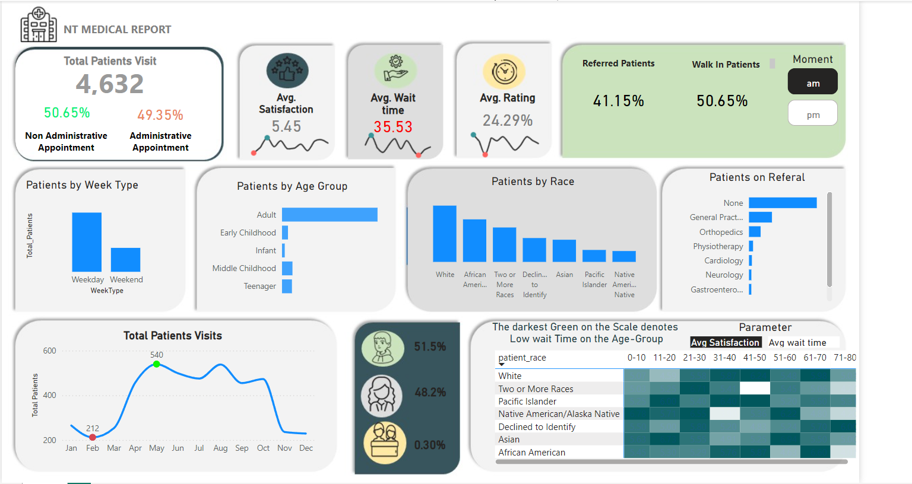

<!DOCTYPE html>
<html lang="en">
<head>
    <meta charset="UTF-8">
    <meta name="viewport" content="width=device-width, initial-scale=1.0">
</head>
<body>

<h1>NT Medical Report Dashboard</h1>

This repository contains the code, data, and documentation for the NT Medical Report Dashboard, a comprehensive visualization tool designed to provide insights into patient visits, satisfaction, and demographics in a hospital setting. The dashboard visualizes key metrics such as total patient visits, average satisfaction, wait times, patient demographics, and more.

<!-- Dashboard Screenshot -->

<h2>Overview</h2>

The NT Medical Report Dashboard provides a detailed view of the hospital's performance based on patient visits and satisfaction metrics. The dashboard is segmented into various sections that offer insights into different aspects of hospital operations, including patient demographics, visit types, and referral patterns.

<h2>Data</h2>

The data used in this project is stored in a CSV file named <code>Hospital ER.csv</code>. This file includes information on patient visits, demographic details, satisfaction scores, wait times, and referral data. The dashboard visualizes this data to provide actionable insights.

<h3>Data Columns:</h3>
<ul>
    <li><code>patient_race</code>: The race of the patient.</li>
    <li><code>age_group</code>: The age group of the patient.</li>
    <li><code>appointment_type</code>: Indicates whether the appointment was administrative or non-administrative.</li>
    <li><code>satisfaction_score</code>: The patient's satisfaction score.</li>
    <li><code>wait_time</code>: The amount of time the patient waited before being attended to.</li>
    <li><code>visit_time</code>: The time of the visit, categorized into AM or PM.</li>
    <li><code>referral_type</code>: The type of referral given, if any.</li>
</ul>

<h3>New Measures Created from the given data columns</h3>
<ul>
    <li><code>Total Patients</code>: Total patients that visited the hospital..</li>
    <li><code>Average Rating</code>: Average of the rating provided by the patients.</li>
    <li><code>Referral %</code>: Indicates the ratio of patients that were referred to different department.</li>
    <li><code>Gender Percentage of patients</code>: The patient's gender ratio.</li>
    <li><code>Types of Patients.</code>: Finding the ratio of patients that were administrative and non administrative.</li>
    <li><code>Avg. wait_time</code>: The average  amount of time the patient had to waited before being attended to.</li>    
</ul>

<h2>Key Features</h2>

<h3>1. Total Patient Visits</h3>
<ul>
    <li><strong>Total Visits:</strong> Displays the total number of patient visits, with a distinction between administrative and non-administrative appointments.</li>
    <li><strong>Percentage Breakdown:</strong> The dashboard shows the percentage of visits that were non-administrative versus administrative.</li>
</ul>

<h3>2. Average Satisfaction and Rating</h3>
<ul>
    <li><strong>Avg. Satisfaction:</strong> A numerical value representing the average satisfaction score across all patient visits.</li>
    <li><strong>Avg. Rating:</strong> Displays the overall rating given by patients.</li>
</ul>

<h3>3. Average Wait Time</h3>
<ul>
    <li><strong>Wait Time:</strong> The average time patients spent waiting before being attended to.</li>
</ul>

<h3>4. Patient Demographics</h3>
<ul>
    <li><strong>Patients by Week Type:</strong> A bar chart showing the distribution of patient visits across weekdays and weekends.</li>
    <li><strong>Patients by Age Group:</strong> Highlights the distribution of patients across different age groups.</li>
    <li><strong>Patients by Race:</strong> Displays a bar chart of patient visits segmented by race.</li>
</ul>

<h3>5. Referral Information</h3>
<ul>
    <li><strong>Referred Patients:</strong> The percentage of patients who were referred to specialists or other healthcare providers.</li>
    <li><strong>Walk-In Patients:</strong> The percentage of patients who were walk-ins versus those who were referred.</li>
    <li><strong>Patients on Referral:</strong> Shows the distribution of patients based on the type of referral received, such as general practice, orthopedics, and others.</li>
</ul>

<h3>6. Time of Visit Analysis</h3>
<ul>
    <li><strong>Moment (AM/PM):</strong> A toggle option to filter the data based on the time of day when the visits occurred.</li>
</ul>

<h3>7. Detailed Patient Visit Trends</h3>
<ul>
    <li><strong>Total Patient Visits Over Time:</strong> A line chart showing the trend of patient visits across different months of the year, highlighting peaks and troughs.</li>
</ul>

<h3>8. Satisfaction and Wait Time Correlation</h3>
<ul>
    <li><strong>Heatmap:</strong> A heatmap that correlates average satisfaction and wait time with different patient demographics, particularly focusing on race and age group.</li>
</ul>

<h2>Recommendation</h2>

<ul>
    <li><strong>Decreasing the average waiting time in the hospital</strong> Since the average waiting time in the hospital was more than 30mins the hospital should try to decrease it to increase the flow of patients.</li>
    <li><strong>Increase the Satisfaction Score</strong> Since the satisfacton score  of the hospital is low, we can infer that the hospital need to improve its service to satisfy their patiensts.</li>
    <li><strong>Increase the percentage of administrative patients</strong> Since the administrative patients gets the medical benefits it decreases the profit of the hospital. So the hospital should work towards increasing the ratio of non administrative patients.</li>
</ul>

<h2>Future Work</h2>

<ul>
    <li><strong>Integration with Real-Time Data:</strong> Incorporate live data feeds from hospital systems to update the dashboard in real-time.</li>
    <li><strong>Predictive Analytics:</strong> Implement machine learning models to predict patient satisfaction and wait times based on incoming data.</li>
    <li><strong>Expanded Demographics:</strong> Include additional demographic factors such as income level, education, and geographic location.</li>
</ul>

<h2>Usage</h2>

To use this dashboard, clone this repository and open the dashboard file in your preferred environment. Ensure that the <code>Hospital ER.csv</code> file is in the same directory as the dashboard code.

<pre>
<code>
git clone https://github.com/tuladhar07/nt-medical-report.git
cd nt-medical-report
</code>
</pre>
</body>
</html>
